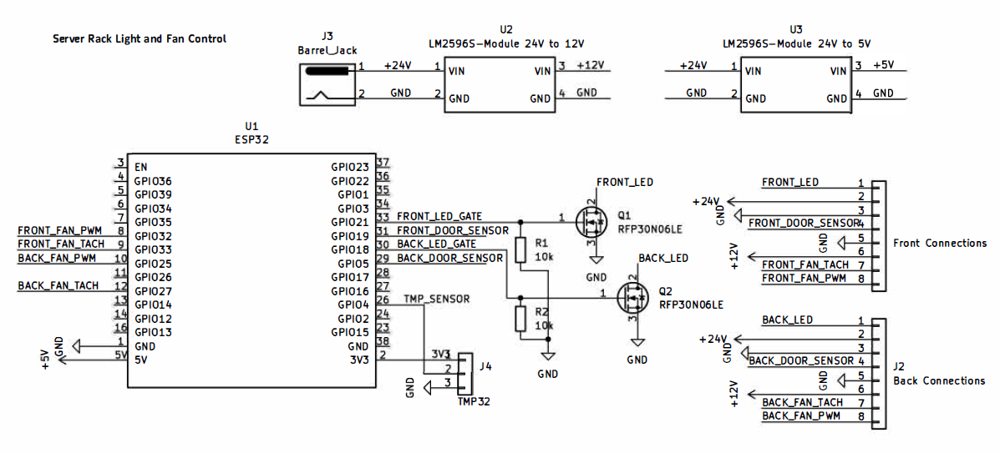
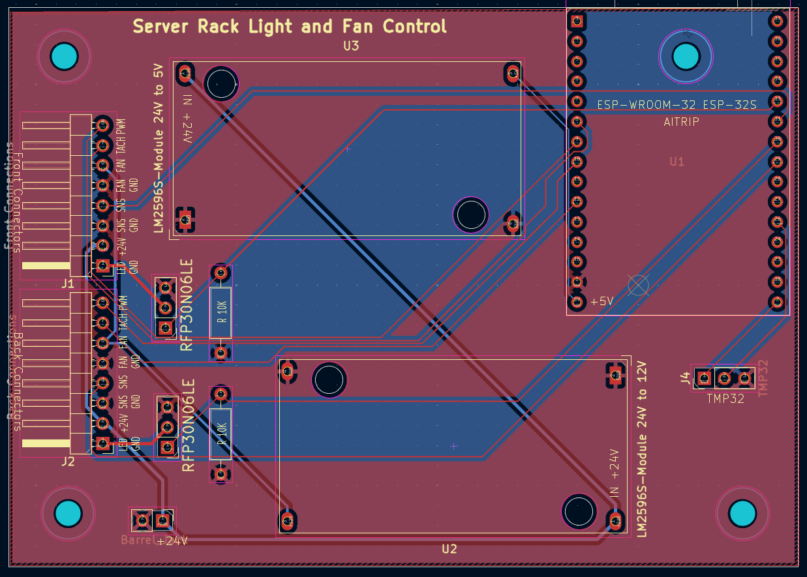

# Server Rack Fan & Light Controller PCB
Provides control for server rack electronics using ESP32.

## Firmware

ESP32 firmware with temperature-controlled fans and MQTT monitoring is available in the [firmware/](./firmware/) directory.

PCB Mounted Components

- J1:	Front Connections - 8 pin Dupont connector
- J2:	Back Connections - 8 pin Dupont connector
- J3:	Barrel Jack for 24V
- J4:	[TMP32](https://www.amazon.com/dp/B08BFY91ZW)
- Q1, Q2:	[RFP30N06LE](https://www.digikey.com/en/products/detail/onsemi/RFP30N06LE/458769)
- R1, R2:	10K
- U1:	[ESP32 - ESP-WROOM-32 ESP-32S](https://www.amazon.com/ESP-WROOM-32-Development-Microcontroller-Integrated-Compatible/dp/B08D5ZD528)
- U2:	[LM2596S-Module 24V to 12V](https://www.amazon.com/dp/B076H3XHXP)
- U3:	[LM2596S-Module 24V to 5V](https://www.amazon.com/dp/B076H3XHXP)

External Components

- [24V LED Light strips](https://www.amazon.com/dp/B0D454HJ8G)
- [12V Fans](https://www.amazon.com/dp/B07HC782D5)
- [Door Sensor](https://www.amazon.com/dp/B0B3D7BM4K)
- [Electrical Wire](https://www.amazon.com/dp/B0CN76J8KR)
- [Dupont Connectors](https://www.amazon.com/dp/B078RRPRQZ)

